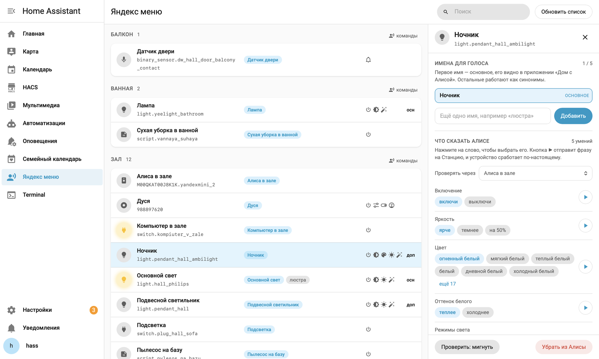

# Yandex Menu for Home Assistant

[Русская версия](README.md)

A "Yandex menu" item in the Home Assistant sidebar that shows every device in your Yandex smart
home and lets you change what normally can only be changed in the Yandex mobile app: what a device
is called by voice, which room it belongs to, and which lamp actually turns on when you say
"Alice, turn on the light".

No separate Yandex login is needed — the integration reuses the session that the
[Yandex Station](https://github.com/AlexxIT/YandexStation) integration already maintains.

## Why you might need it

A home collects a dozen devices over time, and the real problem is remembering what they are called.
To switch off one lamp in the living room you start guessing: "Alice, turn off the chandelier" —
wrong one, "turn off the ambient light" — wrong again. The names live in the Yandex app while you
are sitting in front of Home Assistant.

The panel shows everything at once: one click in the sidebar and you get the full list by room —
which devices exist in your Yandex smart home at all and what each of them is called by voice. The
linked Home Assistant entity is right there next to it. No need to reach for the phone.

From there you can simply look the name up, or fix it on the spot: give the
device a name that makes sense, or add synonyms so it answers to whichever variant comes to mind
first. If you cannot tell which device you are looking at, the "blink" button turns it on for three
seconds.

The familiar "Alice, turn on the light", which lights up the whole room at once, gets fixed here
too — lamps have a main and a secondary light role.

## Features

- **Voice names.** Up to five per device. The panel warns you when a new name duplicates or overlaps
  an existing one: if a name is fully contained in another ("Light" inside "Light strip"), Alice
  acts on the shorter one.
- **Main and secondary light.** The role switch — this is the fix for the "turn on the light"
  problem.
- **Room.** Moves a device between Yandex rooms.
- **Expose a Home Assistant entity to Alice, or take it back.** Finds entities that Alice doesn't
  have yet, adds the label and asks Yandex to re-read the device list. "Remove from Alice" drops
  the label and deletes the device; the entity itself stays in Home Assistant.
- **Name snapshot.** If Yandex recreates a device, all synonyms and its role are lost. The panel
  keeps the last good set and offers to restore it with one click.
- **"Blink" check.** Turns the device on for three seconds — handy when a room has three identical
  lamps and you cannot tell which is which.
- **Refresh device list.** The same thing the refresh button does in the Yandex app.

## Requirements

| Requirement | Why |
|---|---|
| Home Assistant 2024.8 or newer | Uses the current panel registration API |
| [Yandex Station](https://github.com/AlexxIT/YandexStation) by AlexxIT | **Required.** Provides access to the Yandex smart home; it refreshes cookies and tokens on its own |
| [Yandex Smart Home](https://github.com/dext0r/yandex_smart_home) by dext0r | Needed to expose Home Assistant entities to Alice. Without it the panel still lists and edits existing devices, but there is nothing to add |

If you use Yandex Smart Home and want to add devices from the panel, its entity filter must be set
to **label** mode — the panel adds and removes exactly that label.

## Installation

### Via HACS

1. HACS → three-dot menu → **Custom repositories**.
2. URL `https://github.com/busyava/yandex-menu-for-home-assistant`, category **Integration**.
3. Find "Яндекс меню" in the list and click **Download**.
4. Restart Home Assistant.
5. **Settings → Devices & services → Add integration → Яндекс меню.** No credentials are asked,
   only a confirmation.

### Manually

1. Copy the `custom_components/yandex_menu` folder into `/config/custom_components/` on your
   Home Assistant.
2. Restart Home Assistant.
3. Add the integration as described above.

The sidebar item appears afterwards and is visible to administrators only. If you don't see it,
reload the page with Ctrl+Shift+R — browsers cache the sidebar.

## Usage

The list on the left groups devices by room and shows the name, the linked Home Assistant entity,
the synonyms, the role and an online dot. Clicking a device opens the editor on the right.

### Names

The first name is the primary one, and it is what the Yandex app shows. The rest are equal
synonyms: with both names in place, "turn on the night light" and "turn on the chandelier ambient"
work the same.

To promote a synonym, press the star. Yandex has no rename call: names can only be added and
removed, and the primary one is simply the oldest. The panel does the shuffling for you — it drops
the other names and adds them back after the one you picked.

Five names is the hard limit. Yandex rejects the sixth, so the panel disables the field in advance.

### Light role

"Alice, turn on the light" only switches on lamps whose role is **main light**. Anything marked
**secondary** responds to its own name or to "turn on the ambient light". Every lamp has the role
switch.

### Exposing a device to Alice

Start typing a name or an entity id in the search box — a section with entities Alice doesn't have
yet appears. "Expose to Alice" adds the label and asks Yandex to refresh; the device shows up in
about ten seconds.

Yandex refuses entities that are `unavailable` — the panel says so and still adds the label, so the
device appears once the entity comes back online.

## Good to know

The integration talks to the same private API the Yandex app uses. It has no official documentation
and Yandex may change it without notice, in which case the panel will need a fix. Nothing here is
irreversible — everything it does can also be done by hand in the Yandex app.

Device control (on, off, brightness, colour) is intentionally not duplicated: regular Home Assistant
cards already do that. This panel only covers what is otherwise phone-only.

## Troubleshooting

**No sidebar item.** Reload the page with Ctrl+Shift+R.

**"Yandex Station integration not found".** Set
[it](https://github.com/AlexxIT/YandexStation) up first — the smart home access comes from there.

**The device didn't appear after "Expose to Alice".** Usually the entity is `unavailable`, and
Yandex won't accept those. Bring it back online and press "Refresh device list".

**A device arrived named "0".** That comes from an empty alias in the Home Assistant entity
registry. The panel cleans aliases before exposing, but if the device was created earlier, delete
it in the panel and expose the entity again.

**A Yandex error shown in the panel.** Those texts come from Yandex itself and are displayed as is:
"this device already has such a name", "too many names for a device" and the like.

## Support the project

The plugin is free and will stay that way. If it came in handy, you can buy the author a coffee:

Any amount, card payment, no sign-up needed. Note that CloudTips accepts cards issued by Russian
banks only — international cards will not go through.

## License

MIT — see [LICENSE](LICENSE).
